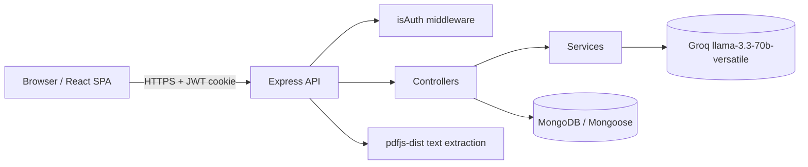

# Architecture — InterviewIQ.AI

## System Overview

Two independent packages (`client/`, `server/`) with no monorepo tooling. The client is a Vite SPA; the server is a stateless Express API authenticated via a JWT HttpOnly cookie.

## Request Flow — Resume Analysis

1. **Upload** — Client `POST`s a PDF (`multipart/form-data`, field `resume`) to `/api/resume/analyze` (also `/api/interview/resume`).
2. **Extract** — `multer` saves the file; `analyzeResume` (`interview.controller.js`) reads it with `pdfjs-dist`, converts each page to plain text, and concatenates into `resumeText`.
3. **AI structured parse** — `askAi` (`openRouter.service.js`) calls Groq `chat/completions` with a system prompt requesting strict JSON: `{role, experience, projects[], skills[]}`.
4. **Respond** — The backend returns `{role, experience, projects, skills, resumeText}`; the client auto-fills the setup form and stores the result.
5. **Generate questions** — Client `POST`s `{role, experience, mode, resumeText, skills, projects}` to `/api/interview/generate-question`; Groq returns 5 questions; an `Interview` is created and 50 credits are deducted.

The interview session then calls `/api/interview/submit-answer` per question and `/api/interview/finish` to finalize.

## Backend Modules

- **Entry:** `server.js` — Express app, `helmet`, CORS (credentials, `CLIENT_URL`), `express.json({limit:"16kb"})`, `cookieParser`. Mounts routers under `/api`.
- **Routers (`routers/`):** `auth.route.js`, `user.route.js`, `interview.route.js`, `resume.route.js`. (Directory is `routers/`, not `routes/`.)
- **Controllers (`controllers/`):**
  - `auth.controller.js` — `googleAuth` (issues 7-day `access` JWT cookie), `logOut`, `getMe`, and `refreshAuth` (defined but **not mounted**).
  - `user.controller.js` — `getCurrentUser`.
  - `interview.controller.js` — `analyzeResume` (PDF+Groq), `generateQuestion`, `submitAnswer`, `finishInterview`.
- **Middleware (`middleware/`):**
  - `isAuth.js` — validates the `token` cookie JWT; rejects non-`access` types with 401; binds `req.userId` / `req.userRole`. `optionalAuth` variant used by logout.
  - `multer.js` — `upload.single("resume")` for PDF uploads.
- **Services (`services/`):** `openRouter.service.js` — thin Groq client (`askAi`). PDF extraction is inline in `analyzeResume`, not a separate service.
- **Config (`config/`):** `connectDB.js` (Mongoose), `token.js` (`genToken` 7d access; `genAccessToken` 15m / `genRefreshToken` 30d are currently unused).
- **Models (`models/`):** `user.model.js`, `interview.model.js`.

## Frontend Modules

- **Entry:** `main.jsx` wraps `<App>` in Redux `<Provider>` + `<BrowserRouter>`.
- **State:** Redux Toolkit (`redux/store.js` with a single `user` reducer from `userSlice.js`). No async thunks; user is bootstrapped in `App.jsx` via `GET /api/user/current-user`.
- **Routing (`App.jsx`):** only `/` (Home), `/auth` (Auth), `/interview` (InterviewPage), and a `*` 404. There are **no** `/dashboard`, `/profile`, or `/history` routes.
- **Pages (`pages/`):** `Home.jsx`, `Auth.jsx`, `InterviewPage.jsx` (orchestrates the 3 steps), `InterviewReport.jsx` (defined but **not routed** — the report is shown via `Step3Report` inside `InterviewPage`).
- **Components (`components/`):** `AuthModel.jsx` (auth popup, note the filename spelling "Model"), `NavBar.jsx`, `Footer.jsx`, `Step1SetUp.jsx` (config), `Step2Interview.jsx` (session), `Step3Report.jsx` (feedback).
- **Utils:** `utils/firebase.js`.

## AI Integration Layer

Groq is called through the OpenAI-compatible `chat/completions` endpoint with `model: llama-3.3-70b-versatile`. There is **no native PDF input to Groq** — the model is text-only, so the pipeline is text-first (Path A):

- **Path A (implemented):** extract text with `pdfjs-dist` → send text to Groq. Lower token cost (only extracted text, not image tokens), higher accuracy on dense resume text, and more stable production behavior than vision-based parsing.
- **Path B (not implemented):** vision/multimodal PDF processing. Skipped — higher token cost and lower fidelity for text-heavy documents on this model.

The service file is named `openRouter.service.js` for historical reasons but uses Groq exclusively; no OpenRouter references remain.

## Data Models (Mongoose)

**User** (`user.model.js`): `name` (string, req), `email` (string, req, unique, lowercase, trim), `picture` (string), `firebaseUID` (string, unique, sparse), `credits` (Number, default 100, min 0), `role` (enum `user|admin|superadmin`, default `user`), `isActive` (Boolean, default true), `lastLoginAt` (Date), timestamps.

**Interview** (`interview.model.js`): `userId` (ObjectId ref User, req), `role` (String, req), `experience` (String, req), `mode` (String, req, enum **`["HR","Technical","SystemDesign"]`**), `resumeText` (String), `questions[]` (each: `question`, `difficulty`, `answer`, `timeLimit`, `feedback`, `score`, `correctAnswers`, `communication`, `confidence`), `finalScore` (Number, default 0), `status` (enum `Incomplete|complete`, default `Incomplete`), timestamps.

## Known Technical Debt / In-Progress

- **Refresh-token rotation is dead code.** `refreshAuth` exists but is not mounted; `googleAuth` issues only a 7-day `access` cookie and never sets a `refreshToken`. Architecture docs that describe rotation are inaccurate.
- **`express-rate-limit` is installed but unused.** No rate limiting is wired despite earlier docs claiming it.
- **`mode` enum mismatch (real bug).** `Interview.mode` allows only `HR | Technical | SystemDesign`, but the frontend `MODES` send `"Behavioral"` and `"System Design"`. `generateQuestion` persists `mode` (interview.controller.js:184), so selecting Behavioral/System Design throws a Mongoose validation error (500).
- **`InterviewReport.jsx` is unused** (report rendered via `Step3Report` inside `InterviewPage`).
- **No tests present** despite `npm test` / `test:authcat` scripts.
- **Unused dependencies:** `react-hook-form`, `zod`, `framer-motion` (alongside `motion`).
- **Filename quirk:** auth modal component is `AuthModel.jsx` ("Model", not "Modal").

## Could-not-verify notes

- **Groq rate-limit figures** (30 RPM / 1,000 RPD / 12,000 TPM) are external Groq-tier policy, not encoded in the repo; confirm against current Groq documentation before relying on them.
- **Node.js version** is stated as "18+" in the prior README but neither `package.json` sets an `engines` field, so this is a convention, not an enforced constraint.
